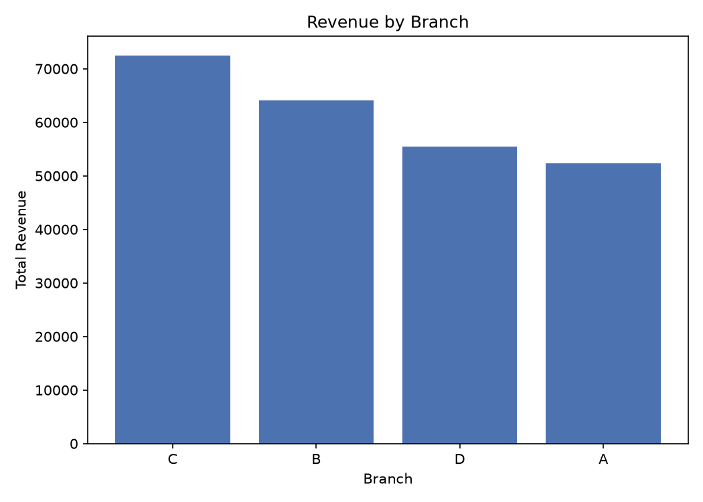
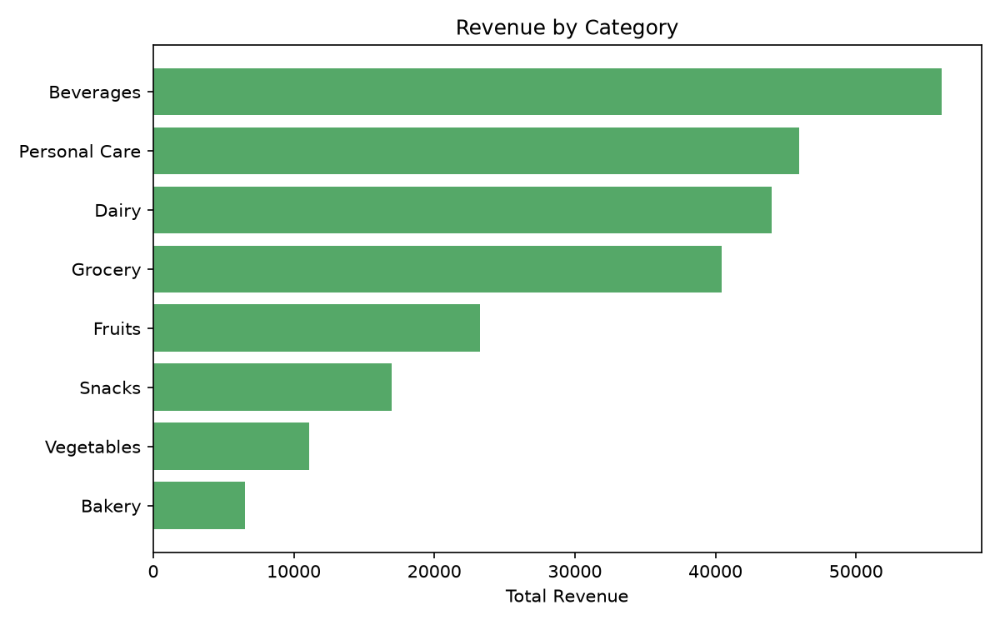
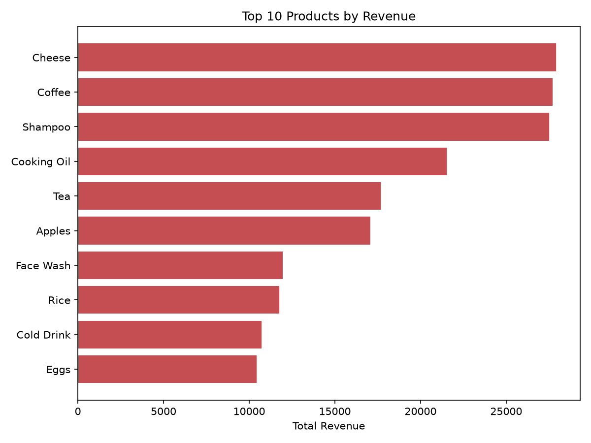
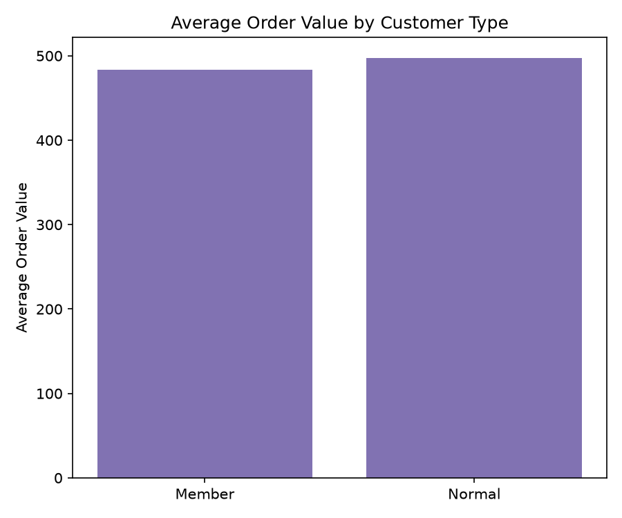
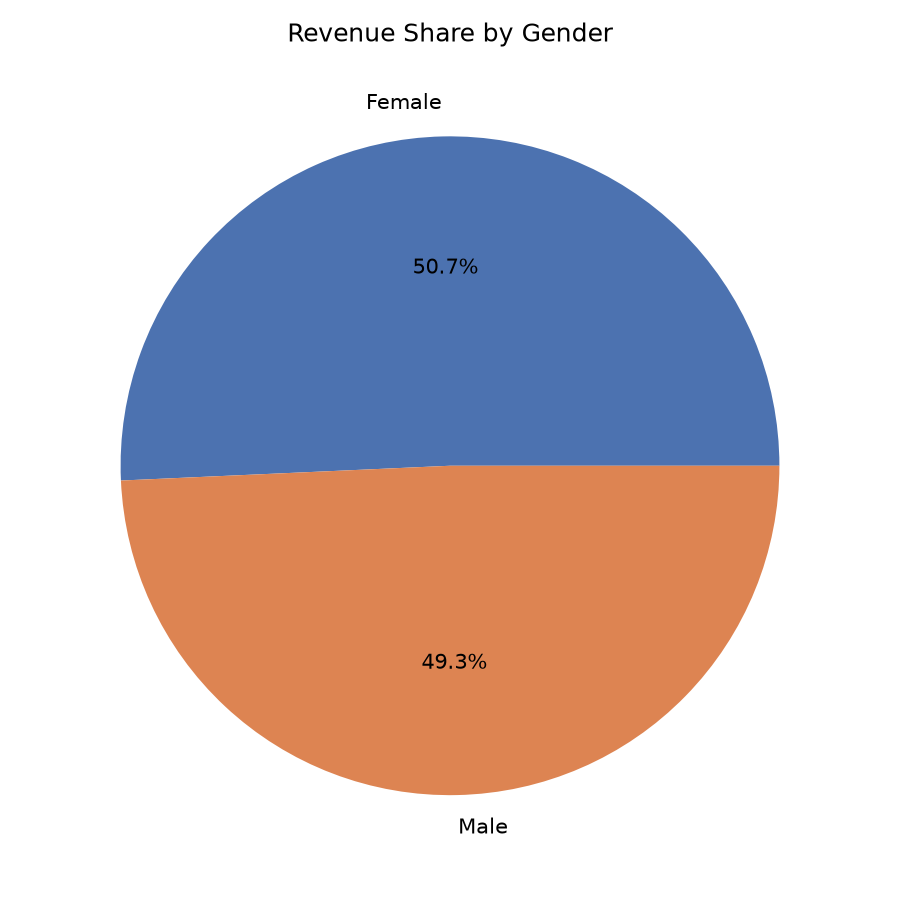
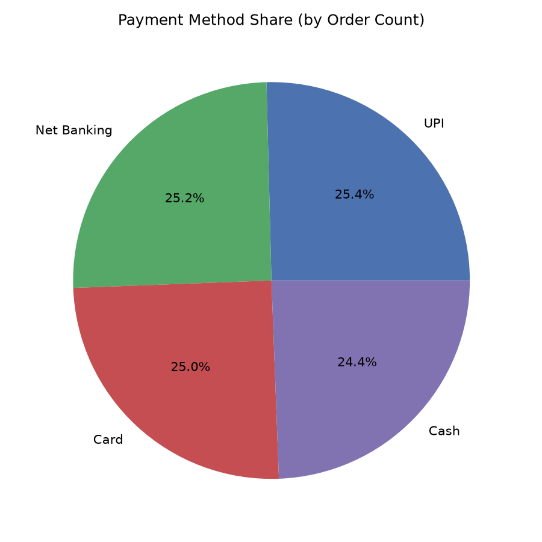
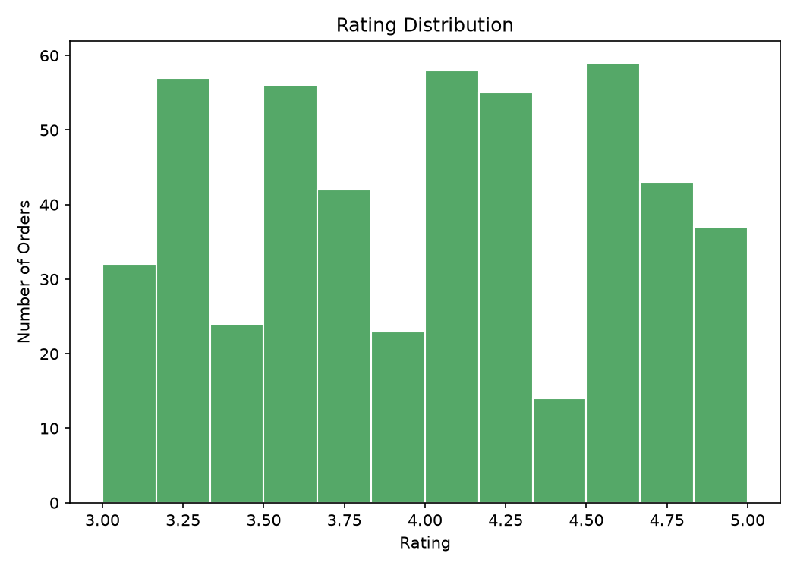
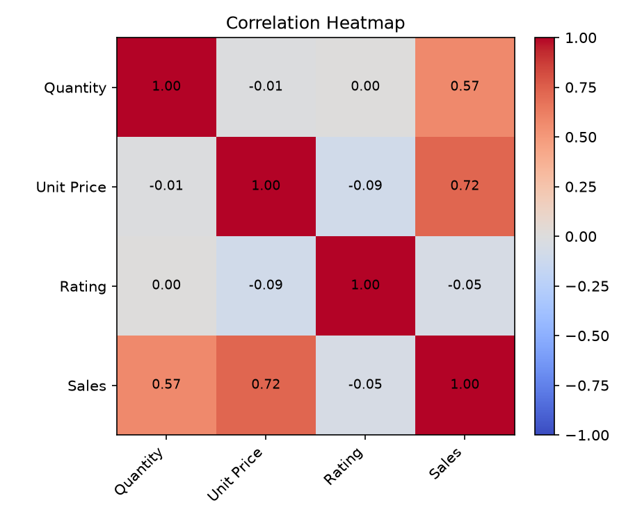
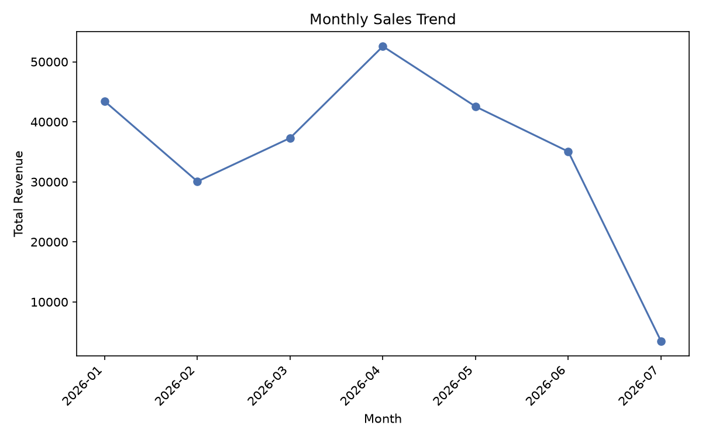
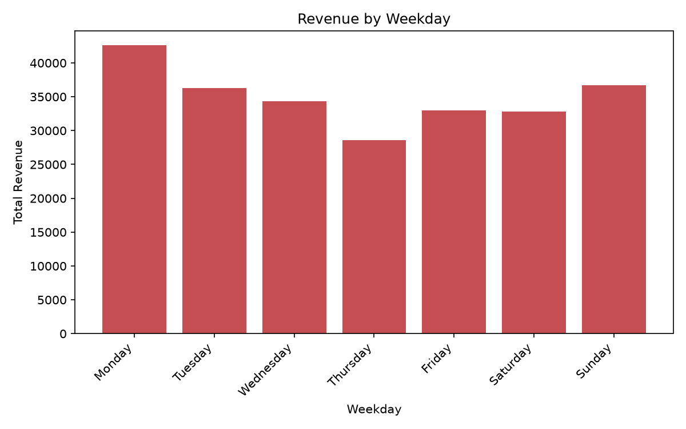

# Supermarket Sales Analysis — Report

*All figures in this report are pulled directly from an actual run of
`src/analyze.py` against `data/SUPER_MARKET_DATA_-_supermarket_sales_500_rows.csv`.
No numbers are estimated or invented. Charts are embedded from
`outputs/figures/`; full tables are available in `outputs/tables/` and
`outputs/summary.json`.*

## 1. Problem Statement

The supermarket operates four branches and wants to understand what is
actually driving its sales: which branches, cities, categories, and
products perform best; how member and walk-in customers differ; which
payment methods customers prefer; whether price, basket size, or category
relate to customer satisfaction; and how sales move over time. This report
answers those questions and turns them into concrete recommendations.

## 2. Dataset

The dataset contains **500 transactions**, one row per invoice, dated
**2026-01-01 to 2026-07-01**. It has 13 columns covering the invoice,
branch/city, customer demographics, product/category, quantity, unit
price, payment method, satisfaction rating, and total sales value. There
were no missing values, no duplicate `Invoice ID`s, and `Sales` matched
`Quantity × Unit Price` exactly on all 500 rows, so no rows needed to be
dropped or corrected during cleaning.

## 3. Methodology

`src/analyze.py` runs the full pipeline end to end:

1. **Load and clean** — parse `Date`, coerce numeric columns, drop exact
   duplicate rows and duplicate `Invoice ID`s (keep first), drop rows with
   missing required fields, and recompute `Quantity × Unit Price` against
   the stored `Sales` value (0.01 tolerance) to flag any mismatches.
2. **Feature engineering** — derive `Month`, `Weekday`, and `IsWeekend`
   from `Date`.
3. **KPIs and group-wise summaries** — revenue, order count, units, and
   average rating grouped by Branch/City, Category, Product, Customer
   Type, Gender, Payment method, Month, and Weekday.
4. **Correlation analysis** — a Pearson correlation matrix across
   `Quantity`, `Unit Price`, `Rating`, and `Sales`.
5. **Charts and outputs** — 10 PNG charts, one CSV per summary table, and
   a single `summary.json` combining everything.

## 4. Key Performance Indicators

| KPI | Value |
|---|---|
| Total transactions | 500 |
| Total revenue | ₹244,411.08 |
| Average order value | ₹488.82 |
| Average rating | 3.99 / 5 (std. dev. 0.57, range 3.0–5.0) |
| Total units sold | 2,768 |
| Date range | 2026-01-01 to 2026-07-01 |
| Branches / Cities | 4 / 4 |
| Categories / Products | 8 / 20 |

## 5. Branch & City Performance

| Branch | City | Revenue | Avg Order | Orders | Units | Avg Rating |
|---|---|---|---|---|---|---|
| C | Mumbai | 72,469.45 | 506.78 | 143 | 807 | 4.05 |
| B | Delhi | 64,116.26 | 482.08 | 133 | 692 | 3.98 |
| D | Bengaluru | 55,468.29 | 466.12 | 119 | 669 | 4.09 |
| A | Jaipur | 52,357.08 | 498.64 | 105 | 600 | 3.84 |

Branch C (Mumbai) leads on every measure that matters — highest revenue,
most orders, and the most units sold — while also holding a solid 4.05
average rating. Branch A (Jaipur) is the weakest performer, generating
about 28% less revenue than Branch C from noticeably fewer orders (105 vs.
143), and it also has the lowest average rating of the four (3.84),
suggesting its underperformance isn't purely a traffic problem.

## 6. Category & Product Insights

Beverages is the top category by revenue (₹56,108.24 from 82 orders),
followed by Personal Care (₹45,943.96) and Dairy (₹43,992.00). Bakery is
the smallest category by revenue (₹6,516.10), but it also carries the
highest average rating of any category (4.24), so its low revenue looks
like a volume/assortment issue rather than a satisfaction one. Snacks
stands out for having a very low average order value (₹226.57) despite a
respectable order count (75), pointing to small, frequent, low-ticket
purchases.

At the product level, **Cheese** is the single biggest revenue driver
(₹27,906.30 from just 26 orders), narrowly ahead of **Coffee**
(₹27,694.87) and **Shampoo** (₹27,497.48). Coffee has the highest average
order value of any product (₹1,153.95), meaning it sells in either high
quantities or high unit prices per basket. At the other end, **Biscuits**
has the lowest average order value (₹150.34) despite a healthy 26 orders —
a low-price, high-frequency item.

## 7. Customer Analysis

Member customers generate more **total** revenue than Normal customers
(₹143,009.30 vs. ₹101,401.78), but this is driven almost entirely by order
volume (296 vs. 204 orders) rather than by spending more per visit — their
average order values are close (₹483.14 for Members vs. ₹497.07 for
Normal). Members do have a slightly higher average rating (4.01 vs. 3.97).

Revenue is almost evenly split by gender: Female customers account for
50.7% of revenue (₹123,954.12, 255 orders) and Male customers 49.3%
(₹120,456.96, 245 orders), with nearly identical average ratings (4.01 vs.
3.98).

## 8. Payment Methods

Payment method usage is essentially uniform across all four options: UPI
25.4% of orders (₹67,910.33), Net Banking 25.2% (₹65,194.93), Card 25.0%
(₹57,265.64), and Cash 24.4% (₹54,040.18). UPI has both the highest order
count and the highest average order value (₹534.73) of the four, while
Cash has the lowest average order value (₹442.95) but the highest average
rating (4.03).

## 9. Ratings & Correlation

Ratings cluster tightly around the mean of 3.99 (std. dev. 0.57, range
3.0–5.0) — there are essentially no very low (1–2) ratings in this
dataset, so satisfaction is consistently good rather than polarized.

|  | Quantity | Unit Price | Rating | Sales |
|---|---|---|---|---|
| **Quantity** | 1.000 | -0.012 | 0.001 | 0.573 |
| **Unit Price** | -0.012 | 1.000 | -0.089 | 0.722 |
| **Rating** | 0.001 | -0.089 | 1.000 | -0.047 |
| **Sales** | 0.573 | 0.722 | -0.047 | 1.000 |

Unit Price correlates with Sales more strongly (r = 0.722) than Quantity
does (r = 0.573), meaning transaction value in this dataset is driven
somewhat more by what customers buy (higher-priced items) than by how much
of it they buy. Quantity and Unit Price are essentially uncorrelated with
each other (r = -0.012), and — notably — **Rating has almost no linear
relationship with Sales, Quantity, or Unit Price** (all |r| ≤ 0.09),
meaning bigger or pricier baskets are neither making customers happier nor
less satisfied in this data.

## 10. Time Trends

Monthly revenue peaks in **April 2026** (₹52,569.77 from 90 orders, and
the highest average order value of any full month at ₹584.11) and is at
its lowest complete-month point in **February 2026** (₹30,068.15). July
2026 shows only ₹3,467.44 from 7 orders because the dataset only covers
the first day of that month (2026-07-01) — it is not a genuine month-end
low and should be excluded from any month-over-month trend comparison.

Monday is the strongest weekday by revenue (₹42,602.44 from 77 orders),
while Thursday is the weakest (₹28,576.26 from 69 orders). Grouping by
weekend vs. weekday, weekend orders have a noticeably higher average order
value (₹511.39) than weekday orders (₹480.39), even though weekend order
volume is lower (136 vs. 364 orders) — consistent with customers making
fewer but larger trips on weekends.

## 11. Recommendations

1. **Investigate Branch A (Jaipur)'s underperformance.** It has the
   lowest revenue (₹52,357.08), fewest orders (105), and lowest average
   rating (3.84) of the four branches — a combined traffic-and-experience
   problem worth a store-level review (staffing, stock availability, or
   local competition).
2. **Protect and expand the Cheese, Coffee, and Shampoo lines.** These
   three products alone contribute ₹83,098.65 (34% of total revenue) from
   just 77 of 500 orders — ensure they never stock out and consider
   featured placement or bundling.
3. **Grow Bakery's order volume rather than its pricing or quality.**
   Bakery has the highest average rating of any category (4.24) but the
   lowest revenue (₹6,516.10), suggesting an assortment or visibility gap,
   not a satisfaction problem — worth testing an expanded range or better
   shelf placement.
4. **Convert more Normal customers to Members.** Members already generate
   41% more total revenue than Normal customers, driven by order
   frequency, not basket size (₹483.14 vs. ₹497.07 average order value).
   A membership push aimed at frequent Normal shoppers is likely to pay
   off through visit frequency rather than requiring any change in
   spending behavior.
5. **Lean into weekend basket-building, not weekend traffic.** Weekend
   average order value (₹511.39) already beats weekday (₹480.39) despite
   lower footfall — weekend promotions should focus on basket add-ons
   (e.g., cross-category bundles) rather than discounts aimed purely at
   driving more visits.
6. **Don't over-invest in a single payment channel.** With all four
   payment methods within a 1-point spread of each other (24.4%–25.4% of
   orders), there's no dominant channel to prioritize — infrastructure and
   promotional spend should stay method-agnostic.

## 12. Limitations

- The dataset covers roughly six full months plus a single day of July
  2026 (2026-07-01), so the July data point is not a real month and is
  excluded from the monthly trend discussion above.
- With only 500 transactions across 4 branches, 20 products, and 8
  categories, some group-level averages (e.g., individual products with
  ~20–30 orders each) are based on fairly small samples and may not be
  statistically robust.
- All relationships reported here (e.g., Unit Price vs. Sales) are linear
  Pearson correlations; they do not capture non-linear relationships and
  do not imply causation.
- The dataset has no repeat-customer identifier, so it's not possible to
  distinguish new vs. returning customers within the Member/Normal split.

## 13. Conclusion

Across 500 transactions and ₹244,411.08 in revenue, Branch C (Mumbai) and
the Beverages category are the clearest revenue engines, Cheese/Coffee/
Shampoo are the standout products, and Member customers already out-earn
Normal customers on volume alone. Customer satisfaction is uniformly high
(3.99 average, low variance) and essentially unrelated to how much or how
expensive a purchase is — meaning the business has more room to grow
revenue (via traffic, assortment, and membership conversion) without any
apparent trade-off against customer experience.
